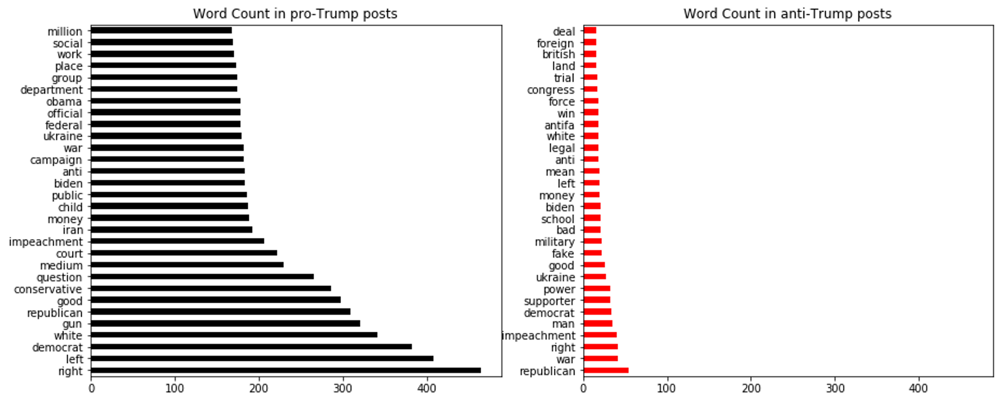

# Overview

The goal of this project is to use [Pushshift's](https://github.com/pushshift/api) Reddit API to retrieve data from 2 different subreddits and build an optimized classification model to predict each post's origin subreddit

## Source of the data

1. [AskThe_Donald](https://www.reddit.com/r/AskThe_Donald/), a pro-Trump subreddit. 

2. [Enough Trump Spam](https://www.reddit.com/r/EnoughTrumpSpam/), an anti-Trump subreddit. 

## Data Gathering

Using the api, I gathered 5000 latest posts from each subreddit with purpose to create a balanced dataset, so the full dataset has  10,000 posts from both subreddits in total

# EDA

## Data Cleaning

### Subreddit

Since the purpose of the project is to classify subreddit, I changed column "subreddit" from subreddit name to 0 for anti-Trump, Enough Trump Spam and 1 for pro-Trump, AskThe_Donald. 

### Title and Self text

The column "Title" shows the title of the post, and "self text" shows the actual text in the post. There are many removed posts from reddit, which results in many null values in "self text" column. I filled null column with '999', and combined title and self text to 1 "combined" column

### Stop words

In addition to import stopwords from sklearn, I manually created a stop word lists include words that are frequently shown in posts from both subreddits, pronouns, verbs, adjectives that have no important meanings. 

## Data Visualization

Through data visualization, I found some interesting relationships between users from both groups. For example, in Enough Trump Spam, there are significantly less text in posts, and the use of total vocabularies in the posts are also smaller than posts from AskThe_Donald. One cause for such imbalance might be due to the large amount memes, images, and other links that are anti-Trump, authors from Enough Trump Spam simply share these images and links instead of writing text. On the other side, there aren't as many outside resource for pro-Trump authors, so they need to use more words to explain their opinions. 

## Graph

 
 

# Model

### Feature

I used "subreddit" in 1 and 0 as y, and "combination", which combined title and self text as X. I splitted the data into 70% train data and 30% test.

### Model 1: Logistic Regression CountVectorizer

Using pipeline and GridsearchCV, I chose the beset parameter from the range and train a model based on the best parameter. In the end, I received 0.92 for train accuracy and 0.877 for test accuracy. The model predicted 79% of posts from Enough Trump Spam correctly, and 96% of posts from AskThe_Donald correctly.

### Model 2: Logistic Regression TFIDFVectorizer

In this model, I used the same parameter as CountVectorizer. By using its best parameter, I received 0.93 for train accuracy and 0.912 for test accuracy. The model predicted 87% of posts from Enough Trump Spam correctly, and 95% of posts from AskThe_Donald correctly.

### Model 3: Voting Classifier TFIDFVectorizer

I used Adaboost, Gradient Boost, and Random Forest in the Voting Classifier to get the best model with TFIDFVectorizer. I received 0.93 for train acuracy and 0.91 for test accuracy. The model predict 87% of posts from Enough Trump Spam correctly, and 95% of posts from AskThe_Donald correctly.

# Conclusion

- All models perform relatively well to separate class.
- Model 2,3 achieve higher accuracy, so they fit well for pro-Trump authors. 
- All Models achieves high specificity, so they are optimal for anti-Trump authors.
- Low number of  text posts in anti-Trump subreddit might cause inaccuracy in prediction model. We need further research to identify if short on text is commonly seen or caused by small sample size
